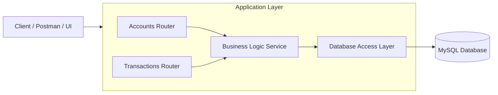
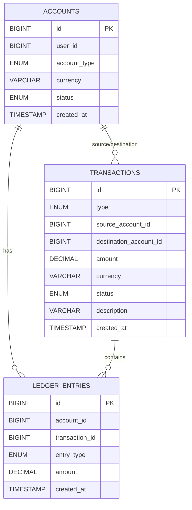

# **Financial Ledger API (Double-Entry Bookkeeping System)**

A backend service built with **Node.js (Express)** and **MySQL**, implementing a fully ACID-compliant **double-entry bookkeeping ledger**.
The API powers a mock banking system where every deposit, withdrawal, and transfer is recorded immutably and balances are calculated from the ledger entries.

This project emphasizes:

* Immutable accounting records
* Double-entry balancing (debit = credit)
* ACID-safe financial transactions
* On-demand balance calculation (no stored balance column)
* Strict prevention of negative balances

---

## **1. Technology Stack**

| Component        | Technology                     |
| ---------------- | ------------------------------ |
| Runtime          | Node.js                        |
| Framework        | Express.js                     |
| Database         | MySQL 8                        |
| Containerization | Docker & Docker Compose        |
| Tools            | Postman, Mermaid diagrams, Git |

---

## **2. Setup & Installation (Docker Recommended)**

### **2.1 Prerequisites**

* Docker & Docker Compose (recommended)
* Git
* Node.js (only required for non-Docker local runs)

### **2.2 Clone the Repository**

```bash
git clone https://github.com/aravindpunyamantula/ledger-api.git
cd ledger-api
```

### **2.3 Environment Variables**

Create a `.env` file:

```env
PORT=3000

DB_HOST=db
DB_PORT=3306
DB_USER=ledgeruser
DB_PASSWORD=ledgerpass
DB_NAME=ledgerdb
```

### **2.4 Database Initialization**

MySQL automatically runs `sql/init.sql` on first startup.
This script creates:

* `accounts`
* `transactions`
* `ledger_entries`

### **2.5 Run Using Docker**

```bash
docker-compose down -v
docker-compose up --build
```

API endpoint base URL:

```
http://localhost:3000
```

MySQL host (mapped):

```
localhost:3307
```

### **2.6 Health Check**

`GET /health`

```json
{
  "status": "ok",
  "time": "2025-12-09T..."
}
```

---

## **3. Database Schema**

### **3.1 accounts**

| Column       | Type                       | Notes           |
| ------------ | -------------------------- | --------------- |
| id           | BIGINT PK                  | Auto-increment  |
| user_id      | BIGINT                     | Required        |
| account_type | ENUM('checking','savings') | Required        |
| currency     | VARCHAR(10)                | Default: INR    |
| status       | ENUM('active','frozen')    | Default: active |
| created_at   | TIMESTAMP                  | Auto-generated  |

### **3.2 transactions**

| Column                 | Type                                    | Notes        |
| ---------------------- | --------------------------------------- | ------------ |
| id                     | BIGINT PK                               |              |
| type                   | ENUM('transfer','deposit','withdrawal') |              |
| source_account_id      | BIGINT FK (nullable)                    |              |
| destination_account_id | BIGINT FK (nullable)                    |              |
| amount                 | DECIMAL(18,2)                           | Required     |
| currency               | VARCHAR(10)                             | Default: INR |
| status                 | ENUM('pending','completed','failed')    |              |
| description            | VARCHAR(255)                            |              |
| created_at             | TIMESTAMP                               |              |

### **3.3 ledger_entries**

| Column         | Type                   | Notes |
| -------------- | ---------------------- | ----- |
| id             | BIGINT PK              |       |
| account_id     | BIGINT FK              |       |
| transaction_id | BIGINT FK              |       |
| entry_type     | ENUM('debit','credit') |       |
| amount         | DECIMAL(18,2)          |       |
| created_at     | TIMESTAMP              |       |

**Ledger entries are immutable — never updated or deleted.**

---

## **4. API Endpoints**

### **4.1 Accounts**

#### **POST /accounts**

Create a new account.

Request:

```json
{
  "user_id": 1,
  "account_type": "checking",
  "currency": "INR"
}
```

Response:

```json
{
  "message": "Account created",
  "account_id": 1
}
```

---

#### **GET /accounts/{id}**

Returns account details + computed balance.

---

#### **GET /accounts/{id}/ledger**

Returns chronological ledger entries.

---

## **4.2 Transactions**

### **POST /deposits**

Creates:

* One `transactions` row
* One **credit** ledger entry

---

### **POST /withdrawals**

Validates:

* Balance must be >= amount
* Otherwise returns **422 Unprocessable Entity**

Creates:

* One `transactions` row
* One **debit** ledger entry

---

### **POST /transfers**

Creates:

* One `transactions` row
* Two ledger entries:

  * Debit (source)
  * Credit (destination)

Implements **double-entry bookkeeping** (net = 0).

---

## **5. Design Decisions**

### **5.1 Double-Entry Bookkeeping**

Each financial event creates ledger entries:

| Operation  | Ledger Entries     |
| ---------- | ------------------ |
| Deposit    | 1 credit           |
| Withdrawal | 1 debit            |
| Transfer   | 1 debit + 1 credit |

System-wide sum of all entries = 0 → balanced accounting.

---

### **5.2 ACID Guarantees**

Every operation uses a MySQL transaction:

1. `BEGIN`
2. Insert into `transactions`
3. Insert debit/credit ledger entries
4. Update transaction status
5. `COMMIT` or `ROLLBACK`

This ensures:

* Atomic writes
* Consistent foreign-key-safe state
* Isolation between concurrent operations
* Durable storage after commit

---

### **5.3 Transaction Isolation**

The system uses MySQL default:

### **REPEATABLE READ**

Advantages:

* No dirty reads
* Consistent snapshot
* Safe for financial workloads

---

### **5.4 Preventing Negative Balances**

Balance is calculated live:

```sql
SUM(
  CASE WHEN entry_type='credit' 
       THEN amount 
       ELSE -amount 
  END
)
WHERE account_id = ?
```

Before withdrawals/transfers:

* Compute balance
* Reject if `balance < amount`
* Return HTTP **422**

---

## **6. Architecture Diagram**



---

## **7. ERD (Database Schema)**



---

## **8. Postman Collection**

The Postman collection is included in the repository:

```
postman_collection.json
```

Import it into Postman to test all endpoints.

---

